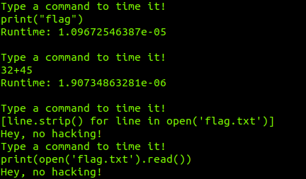

# Timed - MISC[ 50 ]

I found this cool program that times how long Python commands take to run! Unfortunately, the owner seems very paranoid, so there's not really much that you can test. The flag is located in the file flag.txt on the server.

`nc p1.tjctf.org 8005`

### Recon :

After spending much time on this program by typing all kinds of commands I came to the realisations that this program acted just like the Python shell.
So it only took python commands and no Unix ones.

Then i tried some one-liners to read the file `flag.txt`

### Solution : 

We know that we can get the time a command takes to run and this seemed similar to the Time-based SQL Attack that I'm familiar with. So at the last minute, I wrote the script and flag was revealed.

P.S. After the CTF I came to know the more concise and beautiful solution for it was to use the errors in python

`raise NameError(open('flag.txt').read(100))`

